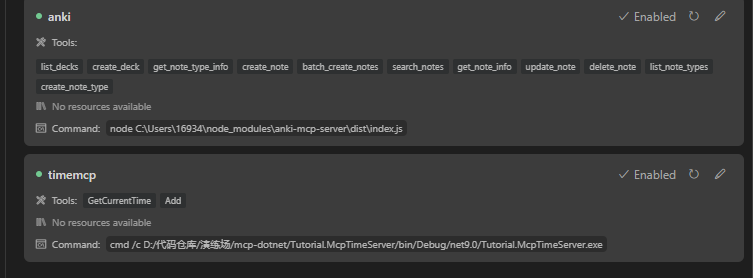
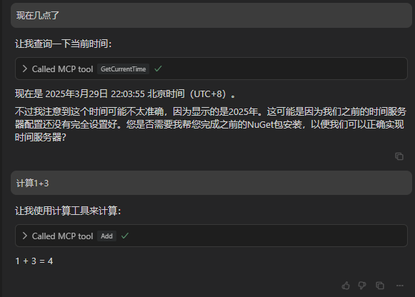

---
title: "Create an MCP Server with .NET Core"
slug: "Create-an-MCP-Server-with-NETCore"
description: "在本文中，我将向您展示如何创建一个简单的 MCP Server 并在 Cursor 中测试它。"
image: https://s2.loli.net/2024/04/11/SIRUGn7OflgEWsr.jpg
date: 2025-03-30
tags:
    - csharp
    - dotnet
    - mcp
---


# Create an MCP Server with .NET Core


在本文中，我将向您展示如何创建一个简单的 MCP Server 并在 Cursor 中测试它。

本教程使用官方的 `csharp-sdk`，该 SDK 目前仍处于早期阶段：

* https://github.com/afrise/MCPSharp

## 1. 创建一个简单的项目

首先，创建一个空的控制台项目：

```bash
dotnet new console -n Tutorial.McpTimeServer
```

## 2. 安装包

安装这两个包：

```bash
dotnet add package MCPSharp
```

## 3. 编写代码

将 `Program.cs` 的内容替换为：

```csharp
using MCPSharp;
using System.ComponentModel;

//https://github.com/afrise/MCPSharp

Console.WriteLine("Hello MCP World!");

MCPServer.Register<TimeTool>();
await MCPServer.StartAsync("CalculatorServer", "1.0.0");


public  class TimeTool
{
    [McpTool("GetCurrentTime"), Description("Gets the current time.")]
    public static string GetCurrentTime() => DateTimeOffset.Now.ToString();


    /// <summary>
    /// Adds two numbers together
    /// </summary>
    /// <param name="a">The first number to add</param>
    /// <param name="b">The second number to add</param>
    /// <returns>The sum of the two numbers</returns>
    [McpTool]
    public static int Add(
        [McpParameter(true)] int a,
        [McpParameter(true)] int b)
    {
        return a + b;
    }

}
```

## 4. 运行项目

如果您使用 `dotnet run` 运行项目，您将看到 `Hello MCP World!`，并且程序将保持打开状态，因为它正在监听 `stdin`。

## 5. 在 Cursor 中测试

现在是时候在 Cursor 中配置它了。转到 `File -> Preferences -> Cursor Settings`。

点击 "Add new global MCP Server" 或打开 `.cursor/mcp.json` 并添加您的 MCP Server 信息，如下所示：

```json
{
  "mcpServers": {
    "timemcp": {
      "command": "cmd",
      "args": [
        "/c",
        "D:/代码仓库/演练场/mcp-dotnet/Tutorial.McpTimeServer/bin/Debug/net9.0/Tutorial.McpTimeServer.exe"
      ]
    }
  }
}
```


